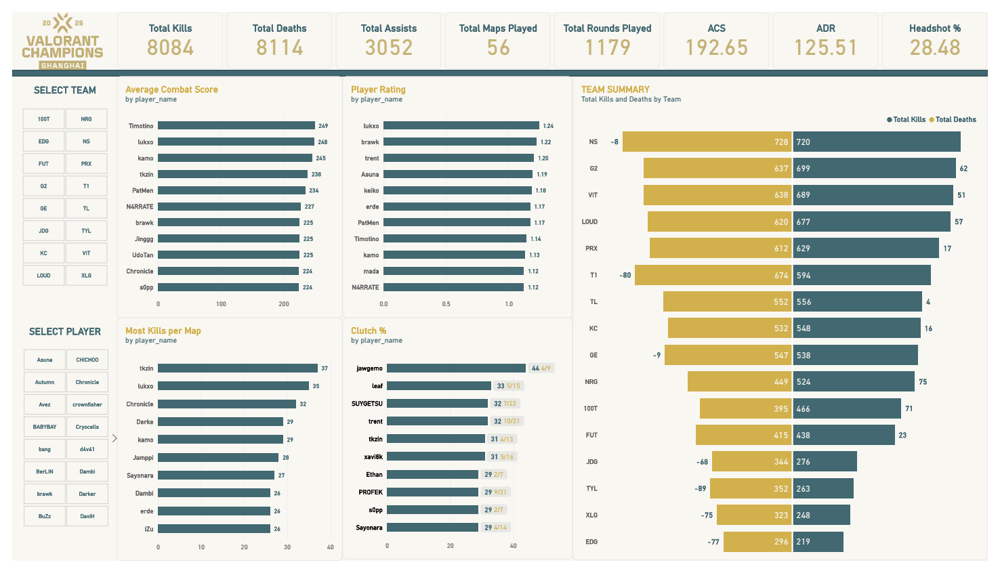

# VLR Champions 2026 Stats Web Scraping Project

This project is a lightweight data pipeline for scraping and processing Valorant player statistics from the VLR.gg event page for Valorant Champions 2026. It extracts a leaderboard table from the website, transforms the raw values into clean, analysis-ready data, and saves the results as Parquet files for downstream analysis and visualization.

## Project purpose

The goal of this project is to collect structured player performance data from a public esports stats page and turn it into a usable dataset. Instead of manually copying statistics from the website, the pipeline automates the process and standardizes the output for further analysis.

The workflow includes:
- Fetching the HTML of the target VLR.gg page
- Parsing the stats table with BeautifulSoup
- Extracting player names, teams, agents, and performance metrics
- Cleaning and normalizing the scraped data
- Saving the raw and transformed datasets to Parquet files

## What the project does

The scraper targets the Valorant Champions 2026 event statistics table and captures fields such as:
- player name
- team name
- agents used
- maps played
- rounds played
- rating
- K/D ratio
- ACS
- ADR
- KPR/APR
- first kill and death percentages
- headshot and clutch percentages
- total kills, deaths, assists, and other summary metrics

After extraction, the script cleans the dataset by:
- standardizing column names
- splitting player and team values from combined table data
- removing unwanted columns
- converting text values into numeric types
- replacing placeholder values such as "-" or "N/A" with null values

## Tech stack

- Python
- requests for HTTP requests
- BeautifulSoup for HTML parsing
- pandas for data manipulation
- pyarrow for Parquet storage
- lxml for HTML parsing speed and reliability

## Repository structure

- `main.py` – orchestrates the full scraping and transformation pipeline
- `src/extract.py` – fetches the web page and extracts the stats table
- `src/transform.py` – cleans and standardizes the scraped dataset
- `src/load.py` – saves the DataFrames to Parquet files
- `data/raw/` – raw extracted table data
- `data/clean/` – cleaned, analysis-ready dataset

## How to run

1. Create and activate a virtual environment if needed.
2. Install dependencies:

   ```bash
   uv sync
   ```

3. Run the scraper:

   ```bash
   python main.py
   ```

This will:
- scrape the VLR.gg stats table
- save the raw output to `data/raw/raw_data.parquet`
- clean the data and save the processed output to `data/clean/clean_data.parquet`

## Example use case

This project is useful for esports analysts, data enthusiasts, and anyone who wants to study player performance trends for a Valorant tournament. The cleaned Parquet dataset can then be loaded into pandas, SQL, or BI tools for deeper analysis, reporting, and visualization.



## Notes

This project is intended for educational and analytical use. Since it relies on public web data, the scraping logic may need updates if the source website changes its HTML structure or table markup.
